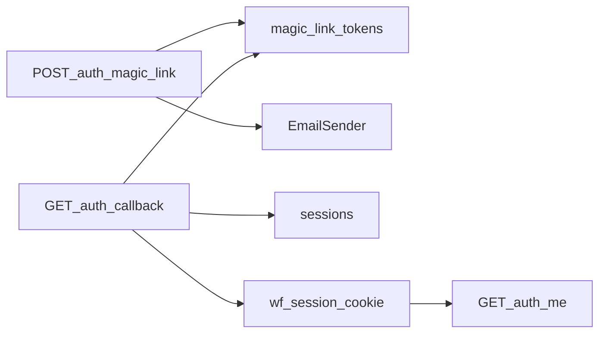
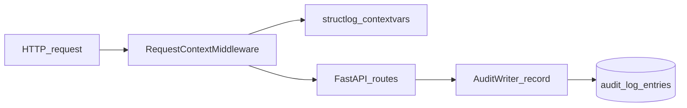
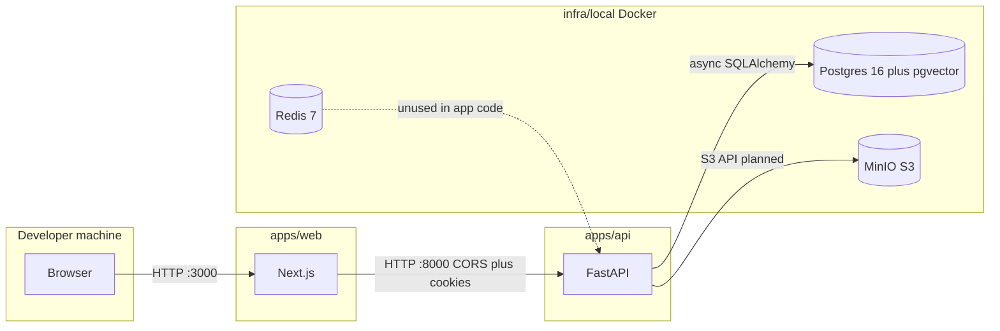
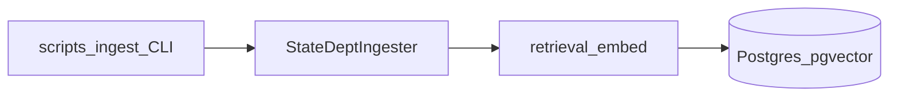
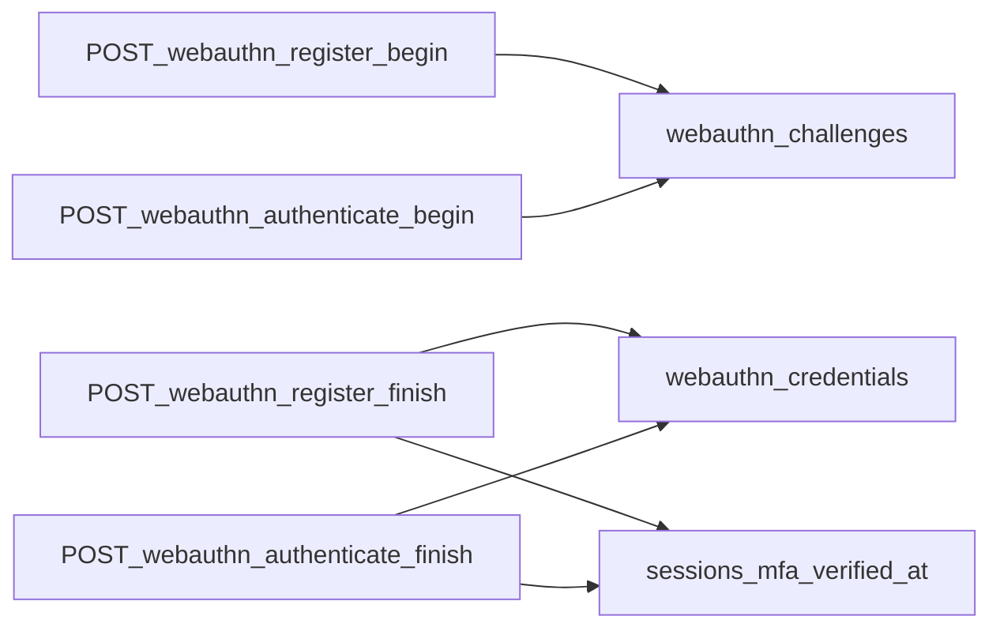

# Data flow (local development)

This diagram describes how the local development stack connects and how authenticated requests flow through the API after the auth milestone.

**Persistence (orgs milestone).** The API defines `organizations` and `users` tables (see Alembic revision `a1b2c3d4e5f6`). The async `OrgRepository` reads and writes rows scoped by `organization_id` for all user lookups and lists. `GET /orgs/admin/users` is an admin-only stub protected by `require_role(admin)` and `require_mfa` (see WebAuthn below).

**Magic-link auth.** `POST /auth/magic-link` resolves `organization_slug` to an `organizations` row, optionally finds an active `users` row for that tenant and email, and always responds with HTTP 204. When a token is issued, a row is inserted into `magic_link_tokens` with a SHA-256 digest only (never the raw secret). `ConsoleEmailSender` prints the callback URL in local dev; production SES is stubbed. `GET /auth/callback` validates the token, marks it consumed, creates a `sessions` row (UUIDv7 primary key), sets the HttpOnly `wf_session` cookie, and redirects to `public_app_url`. `GET /auth/me` and `POST /auth/logout` use `get_request_auth`, which loads the session by cookie, enforces tenant match on `organization_id`, updates `last_seen_at`, and (for logout) sets `revoked_at`. Each state-changing step records `auth.magic_link.request`, `auth.magic_link.consume`, or `auth.logout` via `AuditWriter` when an organization context exists.

**Audit log (append-only).** Each HTTP request passes through `RequestContextMiddleware`, which assigns a UUIDv7 `request_id`, stores it on `request.state`, and binds `request_id` (plus basic HTTP fields) into structlog context variables so JSON logs include correlation metadata. State-changing handlers will call `AuditWriter.record` via the `get_audit_writer` FastAPI dependency; rows land in `audit_log_entries` (Alembic `f6e5d4c3b2a1`) with merged JSON metadata including `request_id`. PostgreSQL triggers reject `UPDATE` and `DELETE` on that table so the log stays append-only at the database layer, not only in application code.

Redis is started for future queue work and is not used by the API in this milestone.

**Source library ingestion (retrieval milestone).** Global reference tables `source_documents` and `source_passages` (Alembic `i1j2k3l4m5n6`) store State Department human rights report HTML and chunked passages with `vector(3072)` embeddings from OpenAI `text-embedding-3-large`. Operators run `make ingest` or `poetry run python -m scripts.ingest` from `apps/api` with `--source state_dept`, `--year 2024`, and `--country` in `ER`, `HN`, or `VE`; optional `--fixture-path` reads local HTML instead of HTTP. The `StateDeptIngester` pipeline discovers URLs, fetches HTML, parses H2 or H3 sections into passages, calls `retrieval.embed.embed_texts` with batching and backoff, and upserts rows keyed by `(source_family, content_hash)` so re-runs are idempotent. Similarity search uses pgvector distance on `embedding::halfvec(3072)` with an HNSW index on that expression (pgvector dimension limits for plain `vector`).

**WebAuthn admin MFA.** Admin users enroll passkeys via `POST /auth/webauthn/register/begin` and `POST /auth/webauthn/register/finish` (challenge rows in `webauthn_challenges`, credentials in `webauthn_credentials`, Alembic `h2b3c4d5e6f7`). Each ceremony row is scoped by `organization_id` and `session_id`. Successful registration or authentication sets `sessions.mfa_verified_at`. `GET /auth/me` returns `mfa_verified` and `webauthn_credential_count` so the Next.js app can route admins to register or authenticate before calling admin APIs. `POST /auth/webauthn/authenticate/begin` and `.../finish` assert the user already has at least one stored credential. `require_mfa` returns 403 for admin sessions with a null `mfa_verified_at`. `auth.webauthn.register_finish` and `auth.webauthn.authenticate_finish` are written to the audit log. The API enables `CORSMiddleware` with `allow_credentials=True` and origins derived from `public_app_url` (plus common localhost variants) so `@simplewebauthn/browser` calls from the web app can send the session cookie cross-origin in local dev.

