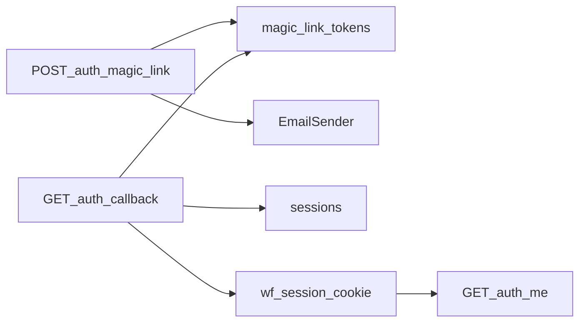
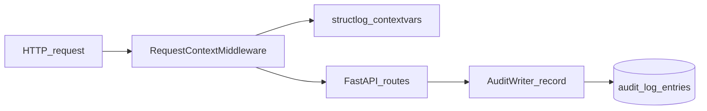
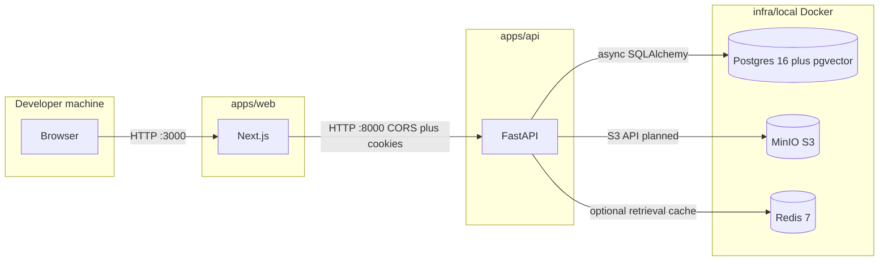
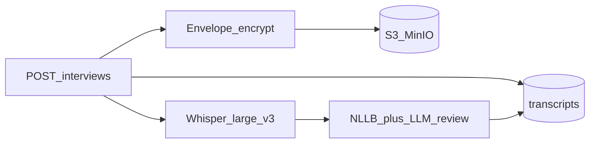
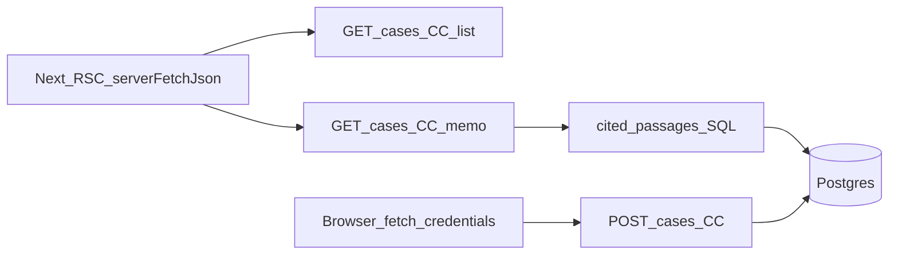
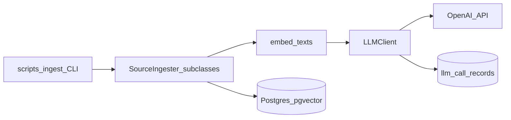
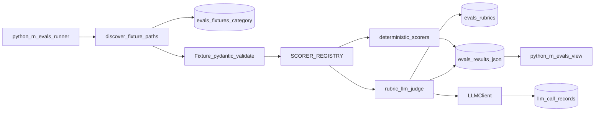
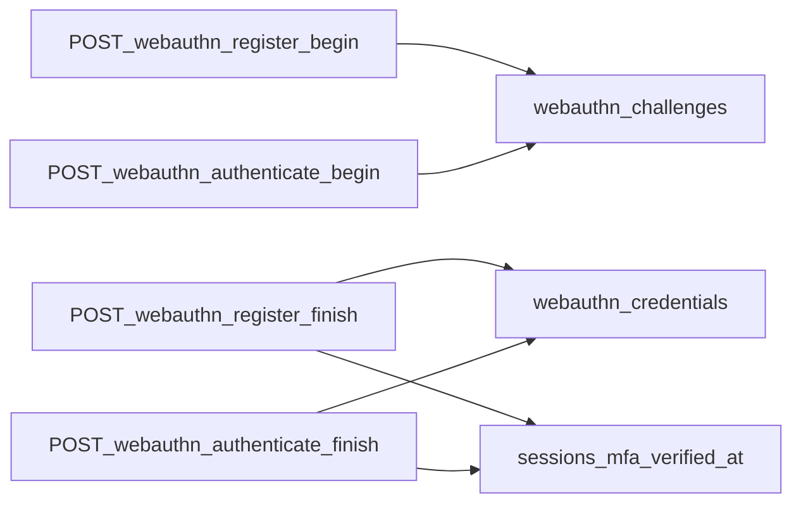

# Data flow (local development)

This diagram describes how the local development stack connects and how authenticated requests flow through the API after the auth milestone.

**Persistence (orgs milestone).** The API defines `organizations` and `users` tables (see Alembic revision `a1b2c3d4e5f6`). The async `OrgRepository` reads and writes rows scoped by `organization_id` for all user lookups and lists. `GET /orgs/admin/users` is an admin-only stub protected by `require_role(admin)` and `require_mfa` (see WebAuthn below).

**Magic-link auth.** `POST /auth/magic-link` resolves `organization_slug` to an `organizations` row, optionally finds an active `users` row for that tenant and email, and responds with HTTP 204 when no user is found, when the user is inactive, or after email delivery. When a token is issued for an active user, a row is inserted into `magic_link_tokens` with a SHA-256 digest only (never the raw secret). `ConsoleEmailSender` prints the callback URL in local dev; production SES is stubbed. In **local** environments, when `e2e_magic_link_reveal_enabled` is true and `X-E2E-Secret` matches `e2e_magic_link_secret`, the same handler returns HTTP 200 JSON `{ "magic_link_url": "<callback>" }` instead of sending email so Playwright can mint a session without scraping stdout. `GET /auth/callback` validates the token, marks it consumed, creates a `sessions` row (UUIDv7 primary key), sets the HttpOnly `wf_session` cookie, and redirects to `public_app_url`. `GET /auth/me` and `POST /auth/logout` use `get_request_auth`, which loads the session by cookie, enforces tenant match on `organization_id`, updates `last_seen_at`, and (for logout) sets `revoked_at`. Each state-changing step records `auth.magic_link.request`, `auth.magic_link.consume`, or `auth.logout` via `AuditWriter` when an organization context exists.



**Audit log (append-only).** Each HTTP request passes through `RequestContextMiddleware`, which assigns a UUIDv7 `request_id`, stores it on `request.state`, and binds `request_id` (plus basic HTTP fields) into structlog context variables so JSON logs include correlation metadata. State-changing handlers will call `AuditWriter.record` via the `get_audit_writer` FastAPI dependency; rows land in `audit_log_entries` (Alembic `f6e5d4c3b2a1`) with merged JSON metadata including `request_id`. PostgreSQL triggers reject `UPDATE` and `DELETE` on that table so the log stays append-only at the database layer, not only in application code.





Redis backs an optional 24-hour retrieval candidate cache (passage UUID lists keyed by hashed query plus filters). When `RETRIEVAL_CACHE_ENABLED` is false, `retrieval.passage_search.search` skips Redis reads and writes and always runs embedding plus ANN SQL.

**Source library ingestion (retrieval milestone).** Global reference tables `source_documents` and `source_passages` (Alembic `i1j2k3l4m5n6`) store third-party COI HTML and PDF-derived text as chunked passages with `vector(3072)` embeddings from OpenAI `text-embedding-3-large`. Ingesters live under `apps/api/retrieval/ingestion/`; operators use `make ingest ARGS="--source <name> ..."` (see `scripts/ingest.py`) or `make ingest-all`, and `make refresh-living-sources` for State Dept, USCIRF, and Freedom House on a schedule (cron or Kubernetes CronJob). Upserts are idempotent on `(source_family, content_hash)` while advancing `last_verified_at` on unchanged content. Similarity search uses pgvector distance on `embedding::halfvec(3072)` with an HNSW index on that expression (pgvector dimension limits for plain `vector`).

**Retrieval search and rerank.** `retrieval.passage_search.search` takes an async SQLAlchemy session, normalizes filters (country overlap on `source_documents.country_codes`, optional `publication_date` lower bound, optional `source_family` allowlist), and optionally reads a candidate passage-id list from Redis when caching is enabled. On a cache miss it calls `LLMClient.embed` for the query text, runs an ANN query ordered by `embedding::halfvec(3072) <=> query::halfvec(3072)` so the halfvec HNSW index applies, stores ordered candidate ids to Redis with a 24-hour TTL, then always runs `retrieval.rerank.rerank_passages` (default backend `llm` via `LLMClient.complete_structured` and `RETRIEVAL_RERANK_PROMPT`; optional `cross_encoder` loads `sentence_transformers.CrossEncoder` when configured) before truncating to `top_k`. Results are immutable `RetrievedPassage` rows from `retrieval.schemas`. Import as `from retrieval import search` or `from retrieval.passage_search import search`.

**Country conditions memo DOCX export.** For memos in `complete` status, `GET /cases/{case_id}/country-conditions/{memo_id}/export.docx` validates `FinalMemoStructured` output on the `country_conditions_memos` row, loads citation metadata from `source_passages` joined to `source_documents` via `retrieval.passage_search.fetch_passages_export_meta`, renders a template-driven DOCX with `country_conditions.docx_memo.build_country_conditions_docx_bytes` (template at `apps/api/country_conditions/templates/country_conditions.docx`), streams the file to the browser, and records `country_conditions.memo.export.docx` in `audit_log_entries` (with `db.commit` so the read-side audit row persists).

**Country conditions workbench (Next.js).** Server components under `apps/web/app/cases/[caseId]/country-conditions/` call FastAPI with the browser `wf_session` cookie forwarded on the `Cookie` header (`lib/server-api.ts`, `cache: "no-store"`). `GET /cases/{id}` powers the case shell; `GET /cases/{id}/country-conditions` lists memo rows; `POST` the same path schedules LangGraph (or the **local-only** `country_conditions_e2e_stub` fast path). `GET /cases/{id}/country-conditions/{memo_id}` returns memo JSON plus `cited_passages`: ordered passage bodies joined from `source_passages` / `source_documents` via `fetch_passages_by_ordered_ids` so superscript citations open a client sheet without an extra API call. The browser uses `fetch(..., { credentials: "include" })` for memo creation, DOCX export, and failed-memo retry; pending or generating memos trigger a lightweight client poller that calls `router.refresh()` on an interval. **Playwright E2E** (`make test-e2e`): `scripts.e2e_seed_country_conditions` seeds org, attorney, case, and a fixed `source_passages` row; global setup exchanges `WF_E2E_MAGIC_LINK_SECRET` for `magic_link_url`, follows callback to capture `wf_session`, and writes `e2e/.auth/storage.json`. The API must run with `ENVIRONMENT=local`, `E2E_MAGIC_LINK_REVEAL_ENABLED=true`, `E2E_MAGIC_LINK_SECRET` matching `WF_E2E_MAGIC_LINK_SECRET`, and `COUNTRY_CONDITIONS_E2E_STUB=true`.

**Interview audio and transcription.** `POST /cases/{case_id}/interviews` accepts multipart audio (WAV/MP3/M4A/OGG, max 200 MB, max 60 minutes) with a declared `source_language` (`es`, `zh`, `fr`, `ht`, `ti`, `prs`). The API validates the file, encrypts plaintext with per-tenant envelope encryption (`apps/api/encryption/`, master key `ENVELOPE_MASTER_KEY` locally), stores the blob in MinIO/S3 (`apps/api/storage/`), and creates `interview_audio` plus a pending `transcripts` row. Response is **202** with `interview_audio_id` and `transcript_id`. `TranscriptionService` runs Whisper-large-v3 via `faster-whisper` (CPU locally), then NLLB-200 segment translation and an LLM review pass (`apps/api/translation/`) before marking the transcript `complete`. Poll `GET /cases/{case_id}/interviews/{audio_id}` or `GET /cases/{case_id}/transcripts/{transcript_id}`. Local stub: `TRANSCRIPTION_E2E_STUB=true` uses fixture segment JSON under `apps/api/tests/fixtures/transcription_stub_*.json`. Admin `POST /orgs/admin/revoke-data-key` sets `organizations.data_key_revoked_at` and blocks further decrypt/upload. Seed path `POST /cases/{case_id}/transcripts` remains for tests. Tables: `interview_audio`, extended `transcripts` (Alembic `o5p6q7r8s9t0`, `p6q7r8s9t0u1`).



**Declaration drafting (LangGraph).** Interview text enters via the transcription pipeline above or `POST /cases/{case_id}/transcripts` (manual seed for tests) and optional `POST /cases/{case_id}/prior-statements`. `POST /cases/{case_id}/declarations` creates a versioned `declaration_drafts` row plus `case_artifacts` stub, audits `declaration.generate.start`, commits, and schedules a background LangGraph run (`DeclarationsService` mirrors country conditions). The graph in `apps/api/declarations/graph.py` runs `extract` (structured `ClaimIntermediateRepresentation` via `LLMClient.complete_structured`), deterministic `gap_check` against `declarations/elements.py`, `inconsistency_check` when prior statements exist, then `compose_draft` (first-person sections with inline flag metadata). Flags (GAP, INFERENCE, INCONSISTENCY, AMBIGUITY, TRANSLATION_UNCERTAINTY) persist on the draft row; `PATCH .../flags/{flag_id}` resolves or defers without changing draft text; `POST .../flags/{flag_id}/apply` applies `resolution_text` to the flagged span (or appends for GAP) and marks the flag resolved or deferred. `POST .../declarations/{draft_id}/revise` creates a new version, runs a scoped LLM revise (or an E2E stub when `DECLARATION_E2E_STUB=true`), and merges flags so open GAP/INCONSISTENCY flags are not silently dropped. `GET .../export.docx?mode=working|clean` renders a template-driven DOCX via `wf_docx.declaration` (package name avoids shadowing the third-party `docx` library; template at `apps/api/wf_docx/templates/declaration.docx`). Working mode attaches Word comments for flags, gray shading on inference spans, and footnotes for AMBIGUITY flags. Clean mode returns plain prose only when GAP/INFERENCE/INCONSISTENCY flags are `resolved` or `deferred` (otherwise HTTP 409 with `unresolved_flag_ids`). Optional `?parallel=true` loads the linked transcript and emits a two-column table (source language | English) per section. Export records `declaration.draft.export.docx` in `audit_log_entries`. `GET /cases/{case_id}/interviews/{audio_id}/audio` decrypts stored interview audio for in-browser playback. Local-only `DECLARATION_E2E_STUB=true` skips the graph and writes a fixture draft with sample flags. Tables: `transcripts`, `prior_statements`, `declaration_drafts` (Alembic `n3o4p5q6r7s8`).

**Declaration workbench (Next.js).** Server components under `apps/web/app/cases/[caseId]/declarations/` list drafts (`GET /declarations`), host the guided new-draft flow (`/new` uploads via `POST /interviews` or reuses `GET /interviews`, optional `POST /prior-statements`, then `POST /declarations`), and load draft detail plus transcript (`GET /declarations/{id}`, `GET /transcripts/{id}`). Client islands handle flag resolution (`POST .../flags/{id}/apply` for one-click accept or two-click edit), scoped revision (`POST .../revise`), DOCX export (Working / Clean / Parallel), and transcript segment audio via the stream endpoint. Pending or generating drafts poll with `router.refresh()` every two seconds. Clean export is disabled in the UI while required flags remain open. **Playwright E2E** (`e2e/declarations.spec.ts`): reuses the country-conditions seed case and auth cookie; the API must run with `DECLARATION_E2E_STUB=true` and `TRANSCRIPTION_E2E_STUB=true` in addition to the magic-link E2E settings used for country conditions.

```mermaid
flowchart LR
  seedT[POST_transcripts]
  seedP[POST_prior_statements]
  gen[POST_declarations]
  graph[LangGraph_extract_gap_inconsistency_compose]
  row[(declaration_drafts)]
  revise[POST_revise]
  export[GET_export_docx_working_clean_parallel]
  seedT --> gen
  seedP --> gen
  gen --> graph
  graph --> row
  row --> revise
  row --> export
```



**LLM gateway and call records.** Anthropic and OpenAI SDK usage is confined to `apps/api/llm/`. `LLMClient` exposes async `complete`, `complete_structured`, and `embed`; each provider HTTP attempt inserts one row into `llm_call_records` (Alembic `j0k1l2m3n4o5`) after flush, storing `organization_id` and `user_id` when present (nullable for platform ingestion), token usage JSON, latency, success flag, optional error text, and `input_sha256` of a canonical hash payload (never raw prompts or source text). Prompt templates live as module-level `Prompt` constants in `apps/api/llm/prompts.py`.



**Eval harness.** Practitioner-curated fixtures live at repo root under `evals/fixtures/<category>/*.json` (categories: `citation_faithfulness`, `citation_faithfulness_live`, `declaration_quality`, `transcription_wer`, `translation_quality`). The harness code itself lives at `apps/api/evals/` so LLM-backed scorers route through the same `LLMClient` gateway as production code; no model SDK is imported outside `apps/api/llm/`. Operators run `make eval-run category=<category>` (or `poetry run python -m evals.runner --category <category>` from `apps/api`). The runner discovers fixture JSON files, validates each one against `Fixture` (Pydantic v2, `extra="forbid"` + length caps), and dispatches to a `Scorer` from `SCORER_REGISTRY` (`exact_citation_match`, `wer`, `rubric_llm_judge`, `country_conditions_draft`, `declaration_quality_live`). Deterministic scorers never open a database session; LLM scorers open Postgres for `LLMCallRecord` persistence. Each run writes one versioned `RunManifest` JSON file to `evals/results/<git-sha>-<category>-<ts>.json` (git-ignored except committed baselines). `make eval-view a=<a.json> b=<b.json>` boots a localhost-only stdlib HTTP viewer that renders a side-by-side score diff. **Declaration quality:** `declaration_quality_live` runs the declaration LangGraph on fixture transcripts, serializes draft + flags + sources, and judges with `evals.declaration_judge.v1` against `evals/rubrics/declaration_v1.md`. `make eval-collect-declaration-baseline` commits `baseline-declaration-claude-opus-4-7.json`; `make eval-calibration-check` compares judge per-criterion scores to `evals/calibration/declaration_practitioner_scores.json` on fixtures tagged `calibration` (Pearson r >= 0.7). A path-filtered GitHub Actions workflow (`.github/workflows/evals.yml`) runs citation, live citation, transcription WER, and declaration quality jobs with regression gates against committed baselines.



**WebAuthn admin MFA.** Admin users enroll passkeys via `POST /auth/webauthn/register/begin` and `POST /auth/webauthn/register/finish` (challenge rows in `webauthn_challenges`, credentials in `webauthn_credentials`, Alembic `h2b3c4d5e6f7`). Each ceremony row is scoped by `organization_id` and `session_id`. Successful registration or authentication sets `sessions.mfa_verified_at`. `GET /auth/me` returns `mfa_verified` and `webauthn_credential_count` so the Next.js app can route admins to register or authenticate before calling admin APIs. `POST /auth/webauthn/authenticate/begin` and `.../finish` assert the user already has at least one stored credential. `require_mfa` returns 403 for admin sessions with a null `mfa_verified_at`. `auth.webauthn.register_finish` and `auth.webauthn.authenticate_finish` are written to the audit log. The API enables `CORSMiddleware` with `allow_credentials=True` and origins derived from `public_app_url` (plus common localhost variants) so `@simplewebauthn/browser` calls from the web app can send the session cookie cross-origin in local dev.


