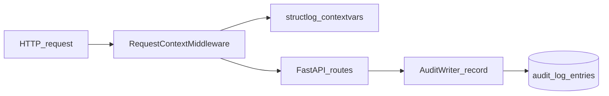
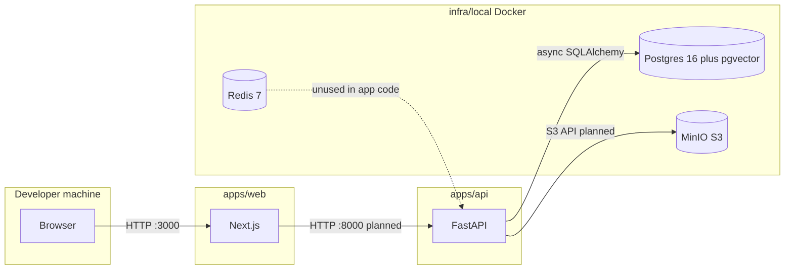

# Data flow (local development)

This diagram describes how the local development stack connects. Product auth and multi-tenant request flows are not implemented in this scaffolding phase.

**Persistence (orgs milestone).** The API defines `organizations` and `users` tables (see Alembic revision `a1b2c3d4e5f6`). The async `OrgRepository` reads and writes rows scoped by `organization_id` for all user lookups and lists. No HTTP handlers on `/orgs` yet beyond an empty router.

**Audit log (append-only).** Each HTTP request passes through `RequestContextMiddleware`, which assigns a UUIDv7 `request_id`, stores it on `request.state`, and binds `request_id` (plus basic HTTP fields) into structlog context variables so JSON logs include correlation metadata. State-changing handlers will call `AuditWriter.record` via the `get_audit_writer` FastAPI dependency; rows land in `audit_log_entries` (Alembic `f6e5d4c3b2a1`) with merged JSON metadata including `request_id`. PostgreSQL triggers reject `UPDATE` and `DELETE` on that table so the log stays append-only at the database layer, not only in application code.

Redis is started for future queue work and is not used by the API in this milestone.
